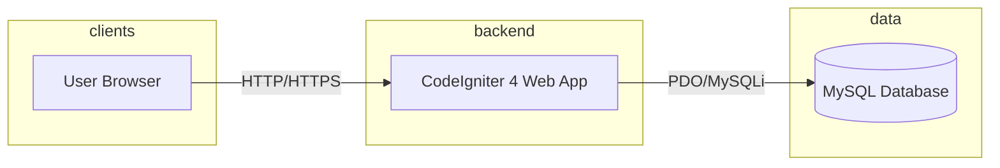

# Architecture Overview

## Context
Chege Jira is a monolithic PHP application built on CodeIgniter 4. It provides project management capabilities with enterprise-grade roles (Admin, Manager, User).

## Containers

| Container | Image | Purpose |
|---|---|---|
| `web` | custom (PHP 8.2 + Apache) | Runs CodeIgniter 4 app on port 9001 |
| `db` | mysql:8.0 | Stores relational data |
| `phpmyadmin` | phpmyadmin | Database administration tool |

## Data Flow

## Security & Trust Boundary
All web routes are protected by CodeIgniter Shield session-based authentication. 
Specific enterprise routes are protected by custom RBAC filters:
- `ManagerFilter`: Only users in the `manager` or `admin` Shield group.
- `AdminFilter`: Only users in the `admin` Shield group.
